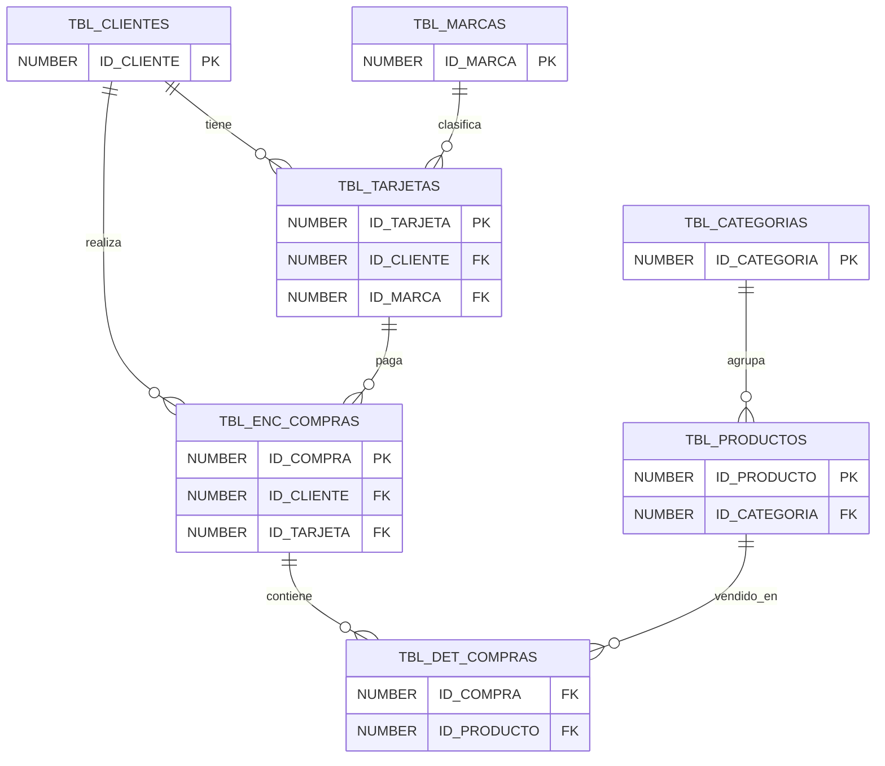

# Diagrama ER - DBA_COMPRAS

Relaciones validadas desde el diccionario de Oracle:

- `TBL_TARJETAS.ID_CLIENTE` -> `TBL_CLIENTES.ID_CLIENTE`
- `TBL_TARJETAS.ID_MARCA` -> `TBL_MARCAS.ID_MARCA`
- `TBL_PRODUCTOS.ID_CATEGORIA` -> `TBL_CATEGORIAS.ID_CATEGORIA`
- `TBL_ENC_COMPRAS.ID_CLIENTE` -> `TBL_CLIENTES.ID_CLIENTE`
- `TBL_ENC_COMPRAS.ID_TARJETA` -> `TBL_TARJETAS.ID_TARJETA`
- `TBL_DET_COMPRAS.ID_COMPRA` -> `TBL_ENC_COMPRAS.ID_COMPRA`
- `TBL_DET_COMPRAS.ID_PRODUCTO` -> `TBL_PRODUCTOS.ID_PRODUCTO`
